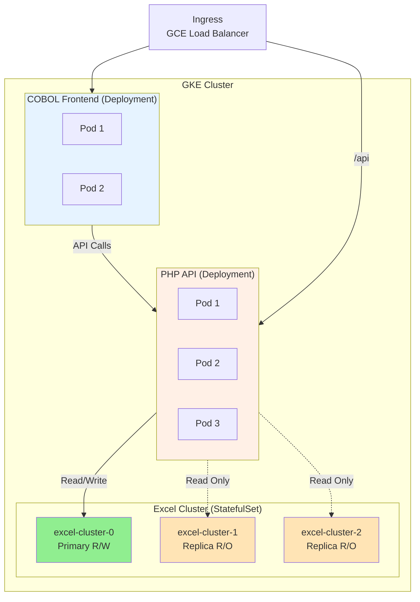

<div align="center">

# ExCoPstack

> exhausting combo. excel as a “database”? imagine suffocating your data with spreadsheets before cobol drags it back to the stone age, and php pretending it’s modern. excop? more like excruciatingly copious trash. put this stack to rest before someone reports it for crimes against tech. lowkey a disaster wrapped in legacy garbage. boomers confirmed.
>
> ~ [roastedby.ai](https://www.roastedby.ai)

[](https://www.microsoft.com/en-us/microsoft-365/excel)
[](https://gnucobol.sourceforge.io/)
[](https://www.php.net/)

## A "most wanted list" project with: Excel, Cobol, PHP stack

</div>


## Tech Stack:

- COBOL - Frontend
- PHP - Backend
- Excel - Database

The communication between COBOL and PHP is done via a **CSV REST API**.

## Running the Project

```bash
docker compose up -d
```

## Stopping the Project

```bash
docker compose down
```

## Accessing the Project

```plaintext
open http://localhost:8888 in your browser
```

## Accessing the PHP API

```plaintext
http://localhost:9000/api/
```

## Accessing the Excel File

- Open the [Excel file](./storage/wanted.xlsx) with Microsoft Excel

## Kubernetes Deployment (GKE Compatible)

ExCoPstack is fully configured for deployment on **Google Kubernetes Engine (GKE)**.

### Quick Deploy to GKE

```bash
# Set your GCP project
export GCP_PROJECT_ID=your-project-id

# Run automated setup (creates cluster, builds images, deploys everything)
./scripts/setup.sh
```

The setup script automatically:
- Creates/uses Google Cloud Artifact Registry
- Builds and pushes Docker images
- Creates/connects to GKE cluster
- Deploys all Kubernetes resources

### Kubernetes Features

- **2 Deployments** (COBOL Frontend, PHP API) with replicas and rolling updates
- **6 Services** for service discovery
- **Ingress** resource (GKE GCE Ingress)
- **ConfigMap and Secret** usage
- **StatefulSet** with 3-node Excel cluster (1 primary R/W, 2 replicas R/O)
- **StorageClass** for persistent volumes

### Architecture



### Documentation

- **Kubernetes Deployment Guide**: [K8S_DEPLOYMENT.md](./K8S_DEPLOYMENT.md)
- **Setup Scripts**: [scripts/README.md](./scripts/README.md)
- **Cleanup**: `./scripts/cleanup.sh` (preserves Artifact Registry)

### Requirements

- Google Cloud Platform account with billing enabled
- `gcloud` CLI installed and configured
- `docker` installed and running

## Star History

[](https://www.star-history.com/#MemerGamer/ExCoPstack&type=date&legend=top-left)

## License

[MIT](./LICENSE)
