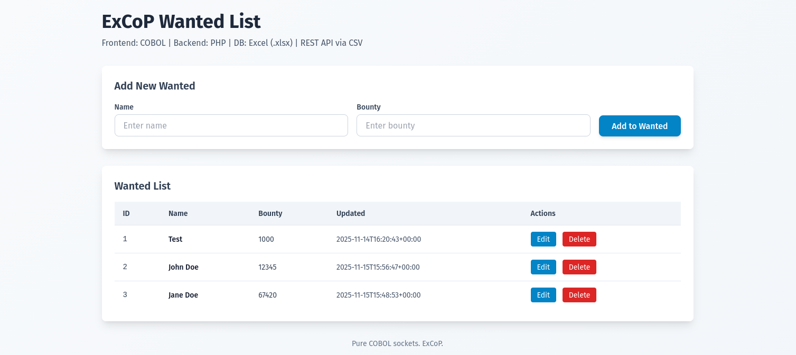

<div align="center">

# ExCoPstack

> exhausting combo. excel as a “database”? imagine suffocating your data with spreadsheets before cobol drags it back to the stone age, and php pretending it’s modern. excop? more like excruciatingly copious trash. put this stack to rest before someone reports it for crimes against tech. lowkey a disaster wrapped in legacy garbage. boomers confirmed.
>
> ~ [roastedby.ai](https://www.roastedby.ai)

[](https://www.microsoft.com/en-us/microsoft-365/excel)
[](https://gnucobol.sourceforge.io/)
[](https://www.php.net/)

## A "most wanted list" project with: Excel, Cobol, PHP stack
</div>



## Tech Stack:
- COBOL - Frontend
- PHP - Backend
- Excel - Database

The communication between COBOL and PHP is done via a **CSV REST API**.

## Project Structure
```plaintext
.
├── cobol
│   ├── Dockerfile
│   ├── index.html
│   └── server.cob
├── docker-compose.yml
├── LICENSE
├── php-api
│   ├── api.php
│   ├── composer.json
│   └── Dockerfile
├── README.md
├── storage
│   ├── wanted.xlsx
│   └── wanted.xlsx.lock
└── ui.png
```

## Running the Project
```bash
docker compose up -d
```

## Stopping the Project
```bash
docker compose down
```

## Accessing the Project
```plaintext
open http://localhost:8888 in your browser
```

## Accessing the PHP API
```plaintext
http://localhost:9000/api/
```

## Accessing the Excel File
- Open the [Excel file](./storage/wanted.xlsx) with Microsoft Excel

## Star History

[](https://www.star-history.com/#MemerGamer/ExCoPstack&type=date&legend=top-left)

## License
[MIT](./LICENSE)